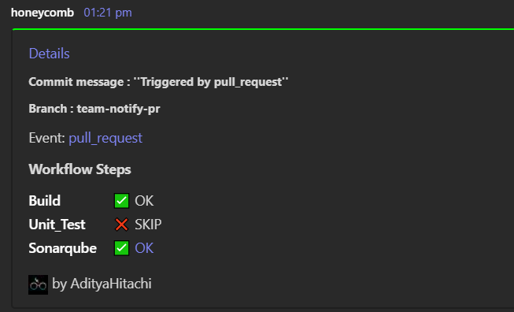
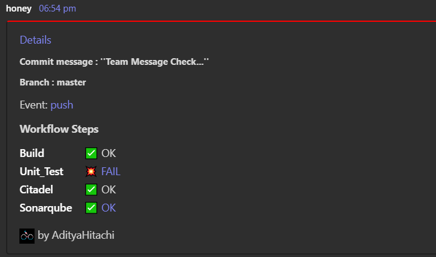

# teams-notify-action 🐝

This Teams Notify action aims to send messages to a  Microsoft Teams channel to help users keep track of all the defined steps in a workflow, along with additional workflow details.

This action explicitly tracks some specific steps within pull request and merge workflows as per [**Honeycomb**](https://hv-eng.atlassian.net/wiki/spaces/MCI/pages/30469586968/CICD+Pipeline) 🐝 initiative.

- For the pull request workflow, this action keeps track of whether the **[Build, Unit Test, and SonarQube]** steps were skipped, executed, or encountered failures. 

- For the merge request workflow, this action monitors and records the status of the **[Build, Unit Test, SonarQube, and Citadel]** steps, tracking whether they were skipped, executed successfully, or experienced failures.

To track Builds, SonarQube analysis, Unit tests, and Citadel scans within our team's notifications, we need to include unique identifiers when triggering GitHub Actions for each specific step. 

Below are id values for each  step :
1) Build step: Build
2) Unit Test step: Unit_Test
3) Sonarqube Scan: Sonarqube
4) Citadel Scan: Citadel

### Example 
```
# Assign unique IDs to Build, Unit Test, SonarQube, and BlackDuck steps as follows:

- name: Build
  id: Build
  run: echo " Run Build Cmds"
  shell: bash

- name: Unit Test
  id: Unit_Test
  run: echo " Run Unit Step Cmd"
  shell: bash

- name: Sonarqube Scan
  id: Sonarqube

- name: Citadel Scan
  id: Citadel
```
**Note - If we do not provide these ID values to their respective steps, all steps will be automatically marked as skipped**

- ✅ OK: Indicates that the step ran successfully without any errors or issues.

- 💥 FAIL: Indicates that the step ran but failed due to some error encountered during its execution.

- ❌ SKIP: Indicates that the step was not executed or was intentionally skipped for some reason.

### Here are examples of how to use this action in your workflow:
#### Calling teams-notify-action in workflow
```
# Calling teams-notify-action action in workflow
- name: Teams Notification
  if: always()
  uses: hv-actions/teams-notify-action@master
  with:
    steps_json: '${{ toJson(steps) }}'    
    teams_Webhook_Url: '${{ secrets.TEAMS_WEBHOOK_URL }}'

```
#### To create a hyperlink in a team message, you can pass the following value to the Teams action:

```
- name: Teams Notification
  if: always()
  uses: hv-actions/teams-notify-action@HCICD-462
  with:
    steps_json: '${{ toJson(steps) }}'
    teams_Webhook_Url: '${{ secrets.TEAMS_WEBHOOK_URL }}' 
    sonar_Host_Url: '${{env.SONAR_HOST_URL}}'              # Server URL for SonarQube, e.g.,https://sonar.orl.eng.hitachivantara.com
    sonar_Project_Key: '${{env.SONAR_PROJECT_KEY}}'        # Project key for SonarQube, e.g.,multi-module-tester
    unit_test_url: 'e.g.,https://test.test'                # Unit test report link, Currently it's only work with Honeycomb CI/CD pipeline
```
**Note - The hyperlink will appear in the message only if the step is executed and valid inputs for the hyperlink are passed to the action**
### Here are examples of how the messages will appear in the team channel:

This message includes the following sections
- Details: Contains a hyperlink providing information about file changes.
- Branch: Displays the name of the branch that triggered the workflow.
- Event: Indicates the type of event that initiated the workflow (e.g., push, pull_request).
- Workflow Steps: Provides information on the status of all workflow steps.
- Footer: The username of the user that triggered the initial workflow run.
- Color Line: A green line indicates a successful workflow, while a red line indicates a failed workflow.

#### For Pull_request


#### For Merge request


#### For Failed workflow
